# Guia de Desenvolvimento - EcoSmart Mobile

Este guia define a arquitetura, as diretrizes de engenharia, o checklist de entrega do **MVP Offline-First com Isolamento de Perfis (RBAC)**, a **Integração com Firebase (Cloud Firestore & Auth)**, os **Métodos de Sincronização e Persistência Local Isolada**, os **Executáveis de Automação** e os **Padrões de Usabilidade Simples e Acessível** do ecossistema **EcoSmart Mobile**.

---

## 🎯 1. Filosofia do Sistema: Simplicidade, Usabilidade e Acesso Descomplicado

O EcoSmart Mobile é projetado com o princípio de **máxima usabilidade e facilidade de acesso**:
* **Sem burocracias:** Processo direto de registro e coleta de resíduos sem exigir fluxos pesados de upload de fotos, leitores de QR Code ou sistemas complexos de gamificação.
* **Operação em 1 Toque:** Coletas e rotas GPS acessíveis diretamente nos cards da listagem.
* **Acessibilidade Offline-First:** Operação plena mesmo em áreas com instabilidade de sinal de internet.

---

## 🏛️ 2. Estrutura e Limites da Arquitetura

O ecossistema é organizado em camadas modulares:

```text
Ecosmart_DMM---Mobile/
├── frontend/                   📱 Aplicativos Mobile (Cidadão, Coletor, Admin)
│   ├── ecosmart-cidadao/       (App Cidadão - Porta 8081)
│   ├── ecosmart-coletor/       (App Coletor / Cooperativa - Porta 8082)
│   └── ecosmart-admin/         (App Administrador - Porta 8083)
├── backend/                    ⚙️ API, Controladores e Serviços de Sincronização
├── database/                   🗄️ Modelagem Relacional (SQL) e Regras Firestore
├── shared/                     🔄 Contratos TypeScript, Firebase, Utilitários e Componentes
├── executaveis/                🚀 Scripts .bat de Automação com Duplo Clique no Windows
├── scripts/                    🛠️ Automações, Sincronização Monorepo e Diagnóstico
└── docs/                       📚 Documentação e Especificações (Firebase Setup, Requisitos)
```

### Perfis e Responsabilidades dos Apps (`frontend/`):
1. **EcoSmart Cidadão (`frontend/ecosmart-cidadao`):** Login/cadastro de cidadão (com Google via Firebase Auth e E-mail/Senha), registrar descartes rápidos (com tipo, quantidade, CEP, endereço e GPS simplificado), gravação direta no Cloud Firestore (`saveCitizenDiscard`), histórico com filtros e busca textual, consulta de dicas e pontos de coleta com rotas, auto-sync, notificações e **Perfil do Cidadão (dados cadastrais e resumo de descartes)**.
2. **EcoSmart Empresa/Catador (`frontend/ecosmart-coletor`):** Login/cadastro de coletor (com Google via Firebase Auth e E-mail/Senha), listar descartes disponíveis com cálculo de distâncias (GPS), ouvintes em tempo real (`onSnapshot`), filtros por resíduo e proximidade, botão direto de rota GPS e confirmação de coleta em 1 toque, auto-sync, notificações e **Perfil do Coletor com Dados Operacionais (veículo, capacidade de carga e coletas realizadas)**.
3. **EcoSmart Admin (`frontend/ecosmart-admin`):** Login restrito de administrador (Google / Chave Mestre `ADMIN2026`), CRUDs completos de resíduos, pontos de coleta e dicas com busca em tempo real, painel de registros gerais com exportação de relatórios ESG em CSV, auto-sync, notificações e **Perfil de Gestor com Governança do Sistema (taxa de reciclagem, volume de entidades cadastradas, cargo e departamento)**.

---

## 🔄 3. Métodos de Sincronização & Persistência Local Isolada

O ecossistema implementa três camadas integradas de sincronização e armazenamento:

```mermaid
flowchart TD
    subgraph Nuvem_e_Servidores ["1. Servidor Centralizado & Nuvem"]
        BackendAPI["Servidor Backend REST / WebSocket\n(Node.js / Express - scripts/sync-server.js)"]
        FirestoreDB["Banco em Tempo Real\n(Cloud Firestore - Listeners onSnapshot)"]
    end

    subgraph AppCidadao ["2. EcoSmart Cidadão"]
        CidadaoUI["App Cidadão (Cadastro de Descartes & Perfil)"]
        CidadaoStorage["AsyncStorage Isolado:\n@ecosmart_cidadao_discards\n@ecosmart_cidadao_session"]
    end

    subgraph AppColetor ["3. EcoSmart Coletor"]
        ColetorUI["App Coletor (Rotas de Coleta & Baixas)"]
        ColetorStorage["AsyncStorage Isolado:\n@ecosmart_coletor_data\n@ecosmart_coletor_session"]
    end

    subgraph AppAdmin ["4. EcoSmart Admin"]
        AdminUI["App Admin (Catálogos, PEVs & Relatórios ESG)"]
        AdminStorage["AsyncStorage Isolado:\n@ecosmart_admin_waste_types\n@ecosmart_admin_records"]
    end

    CidadaoUI -->|1. Salva localmente apenas seus descartes| CidadaoStorage
    CidadaoUI -->|2. HTTP POST / onSnapshot| BackendAPI
    CidadaoUI -->|3. Sincronização Nuvem| FirestoreDB

    ColetorUI -->|1. Salva localmente seus dados de coleta| ColetorStorage
    ColetorUI -->|2. HTTP PATCH Baixa Coleta| BackendAPI
    ColetorUI -->|3. Listener onSnapshot| FirestoreDB

    AdminUI -->|1. Salva localmente catálogos de gestão| AdminStorage
    AdminUI -->|2. HTTP CRUD & Métricas| BackendAPI
    AdminUI -->|3. Listener onSnapshot| FirestoreDB
```



### 3.1. Servidor Backend Centralizado (API REST & WebSocket)
* **Localização:** [`scripts/sync-server.js`](file:///C:/Users/gabri/Documents/faculdade/7%20semestre/DESENVOLVIMENTO%20DE%20SISTEMAS%20PARA%20DISPOSITIVOS%20M%C3%93VEIS/Ecosmart_DMM---Mobile/scripts/sync-server.js) e [`backend/src/server.ts`](file:///C:/Users/gabri/Documents/faculdade/7%20semestre/DESENVOLVIMENTO%20DE%20SISTEMAS%20PARA%20DISPOSITIVOS%20M%C3%93VEIS/Ecosmart_DMM---Mobile/backend/src/server.ts).
* **Porta Padrão:** `3333` (`http://localhost:3333`).
* **Endpoints:** `GET /api/health`, `GET /api/discards`, `POST /api/discards`, `POST /api/discards/:id/collect`, `DELETE /api/discards/:id`, `POST /api/users`.

### 3.2. Banco de Dados em Tempo Real (Firebase Cloud Firestore - Listeners Nativos)
* **Ouvintes em Tempo Real (`onSnapshot`):** Implementados em [`firebaseService.ts`](file:///C:/Users/gabri/Documents/faculdade/7%20semestre/DESENVOLVIMENTO%20DE%20SISTEMAS%20PARA%20DISPOSITIVOS%20M%C3%93VEIS/Ecosmart_DMM---Mobile/shared/services/firebaseService.ts).
* **Listeners Nativos:** `subscribeToDiscards(callback)`, `subscribeToCitizenDiscards(citizenEmail, callback)`, `subscribeToWasteTypes(callback)`, `subscribeToCollectionPoints(callback)`, `subscribeToTips(callback)`.

### 3.3. Persistência Local Isolada por Aplicativo (`AsyncStorage`)
* **EcoSmart Cidadão:** Persiste em `@ecosmart_cidadao_discards` exclusivamente os descartes gerados pelo cidadão logado.
* **EcoSmart Coletor:** Persiste em `@ecosmart_coletor_data` exclusivamente o histórico de coletas realizadas e dados operacionais.
* **EcoSmart Admin:** Persiste em `@ecosmart_admin_*` os catálogos municipais e governança.

---

## 🔒 4. Requisito de Segurança: Proteção de Login, Google Auth e Isolamento de Perfis

- [x] **4.1. Validação Estrita de Perfil no Login (Controle de Acesso RBAC):** Cada app valida obrigatoriamente a propriedade `perfil` (`cidadao` | `coletor` | `admin`) do usuário, bloqueando acessos cruzados com avisos claros.
- [x] **4.2. Autenticação Integrada com Google (Firebase Auth):** Botão **"Continuar com o Google"** presente nos 3 aplicativos com persistência automática de perfil na coleção `usuarios` do Firestore.
- [x] **4.3. Proteção de Cadastro por Tipo de Aplicativo:** App Cidadão gera `cidadao`, App Coletor gera `coletor`, e App Admin exige o **Código de Acesso Administrativo** (`ADMIN2026`).
- [x] **4.4. Isolamento de Sessão e Storage no `AsyncStorage`:** Namespaces isolados por aplicativo: `@ecosmart_cidadao_*`, `@ecosmart_coletor_*`, `@ecosmart_admin_*`.
- [x] **4.5. Centralização e Recuperação de Senha em `shared/`:** `authService.ts` com autenticação, cadastro, `signInWithGoogle`, `requestPasswordReset` e `resetPassword`.

---

## 👤 5. Perfil de Usuário, Edição de Dados Pessoais & Resumo de Atividades

- [x] **5.1. EcoSmart Cidadão (`ProfileScreen.tsx`):** Resumo de descartes (totais, coletados, pendentes), edição de dados cadastrais, telefone/WhatsApp, endereço padrão de coleta, bairro, cidade e bio.
- [x] **5.2. EcoSmart Empresa/Catador (`ProfileScreen.tsx`):** Resumo operacional (coletas realizadas e descartes disponíveis na região), edição de dados de veículo, capacidade de carga e bairros de atendimento.
- [x] **5.3. EcoSmart Admin (`ProfileScreen.tsx`):** Painel de governança (registros gerais, taxa de reciclagem, total de pontos de coleta), dados institucionais, cargo e departamento.

---

## 📶 6. Modo Offline e Resiliência de Rede

- [x] **6.1. Monitoramento de Conexão com a Internet (`NetInfo`):** Hook reutilizável `useNetworkStatus` nos 3 apps com **Banner Visual de "Modo Offline"**.
- [x] **6.2. Acesso e Operação Offline Resiliente:** Leitura de cache local no `AsyncStorage` e escrita offline com flags de sincronização pendente.

---

## 🚀 7. Funcionalidades de Melhorias e Usabilidade Ágil

- [x] **7.1. 🔄 Sincronização Automática em Background (`AutoSyncService`):** Processamento automático na transição para `online` com notificações e alertas.
- [x] **7.2. 🗺️ Geolocalização, GPS e Cálculo de Distâncias (`geoUtils.ts`):** Fórmula de Haversine em tempo real, autopreenchimento de GPS no Cidadão e rotas diretas de navegação.
- [x] **7.3. ⚡ Ações Rápidas no Card do Coletor:** Botão direto de rota GPS e confirmação de coleta em 1 toque.
- [x] **7.4. 🔔 Central de Notificações em Tempo Real (`NotificationModal.tsx`):** Contador de não lidas e histórico de eventos nos 3 apps.
- [x] **7.5. 📊 Relatórios de Sustentabilidade ESG & Exportação CSV (`reportService.ts`):** Métricas ecológicas em tempo real e download de CSV.
- [x] **7.6. 🔍 Busca Textual Instantânea e Filtros:** Pesquisa em tempo real em todas as listagens dos 3 aplicativos.
- [x] **7.7. 🔑 Fluxo de Recuperação de Senha:** Tokens de segurança e redefinição nos 3 apps.

---

## 📂 8. Executáveis e Automação de Inicialização (`executaveis/`)

Scripts com duplo clique (.bat) para Windows com auto-inicialização do servidor e Firebase:

| Arquivo | Função | Porta |
| :--- | :--- | :--- |
| **`MENU-ECOSMART.bat`** | **Painel Principal Interativo:** Menu completo para controlar todos os apps, testes, servidor e Firebase. | — |
| **`1-instalar-dependencias.bat`** | Instala as dependências de todo o monorepo e dos 3 frontends. | — |
| **`2-executar-testes.bat`** | Roda `sync:shared`, checagem TypeScript (`tsc --noEmit`), testes Jest e diagnóstico. | — |
| **`3-iniciar-cidadao.bat`** | Inicia servidor backend + Firebase e abre o **EcoSmart Cidadão**. | `8081` |
| **`4-iniciar-coletor.bat`** | Inicia servidor backend + Firebase e abre o **EcoSmart Coletor**. | `8082` |
| **`5-iniciar-admin.bat`** | Inicia servidor backend + Firebase e abre o **EcoSmart Admin**. | `8083` |
| **`6-sincronizar-modulos.bat`** | Sincroniza imediatamente o diretório `shared/` com os frontends. | — |
| **`7-testar-comunicacao.bat`** | Executa o teste de criação e diagnóstico de sync (API + Firebase). | — |
| **`8-iniciar-servidor.bat`** | Inicia o Servidor Backend REST centralizado de sincronização. | `3333` |

---

## 🧪 9. Qualidade, Testes Automatizados e Cobertura (Etapa Obrigatória)

* **75 suítes de testes** e **386 testes automatizados** (100% de aprovação).
* **0 erros de tipagem estática** TypeScript (`npm run typecheck:all`).
* **Diagnóstico de Comunicação:** `npm run test:communication`.
