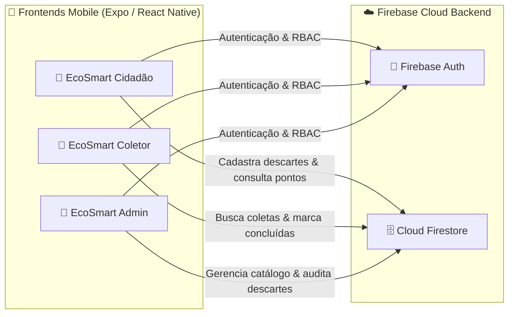

# 📱 Detalhamento Completo dos Aplicativos - EcoSmart Mobile

Este documento descreve detalhadamente cada um dos 3 aplicativos do ecossistema **EcoSmart Mobile**, suas personas, arquitetura, regras de negócio, telas e integrações com o **Firebase**.

---

## 🌐 1. Visão Geral e Princípio de Simplicidade

O **EcoSmart Mobile** foi projetado sob a premissa de **simplicidade, leveza e fácil acesso para qualquer usuário**:
* **Sem barreiras de entrada:** Interface limpa e direta, sem formulários extensos ou fluxos pesados.
* **Operação ágil:** Cidadão registra em segundos e o Coletor visualiza por proximidade GPS e conclui a coleta em 1 toque.
* **Foco no que importa:** Tipo de material reciclável, quantidade, endereço com CEP/GPS e confirmação direta.

---

## 👤 2. Aplicativo: EcoSmart Cidadão (`frontend/ecosmart-cidadao`)

### 🎯 Propósito e Persona
- **Persona:** Cidadãos e estabelecimentos que geram materiais recicláveis (papelão, plástico, vidro, metal, eletrônicos, óleo) e desejam descartá-los de forma simples.
- **Porta padrão:** `8081`

### 🖥️ Telas e Funcionalidades

| Tela | Arquivo | Principais Funcionalidades |
| :--- | :--- | :--- |
| **Autenticação** | `AuthScreen.tsx` | • **Login com Google (Firebase Auth):** Conexão rápida via provedor Google. • Login com e-mail e senha tradicionais. • Cadastro simples de cidadão. • Recuperação de senha com token seguro. • Bloqueio estrito de perfis cruzados (RBAC). |
| **Início** | `HomeScreen.tsx` | • Dashboard acolhedor com avatar dinâmico. • Atalhos diretos para cadastro de descarte, histórico, pontos de coleta e perfil. • Banner de conectividade (Online / Offline). |
| **Cadastrar Descarte** | `RegisterDiscardScreen.tsx` | • **Simples e Direto:** Seleção do tipo de resíduo aceito + quantidade. • **Preenchimento por CEP (ViaCEP):** Digitação de CEP com autopreenchimento de Rua e Bairro. • Botão de captura de GPS simplificado. • **Modo Offline:** Salva localmente e sincroniza automaticamente ao reconectar. |
| **Histórico** | `HistoryScreen.tsx` | • Listagem de todos os descartes cadastrados pelo cidadão. • Busca textual em tempo real por endereço, bairro ou material. • Indicador visual de status (Pendente / Coletado). |
| **Pontos de Coleta** | `CollectionPointsScreen.tsx` | • Catálogo de Ecopontos e Pontos de Entrega Voluntária (PEV) em Cáceres - MT. • Cálculo de distância em km a partir do GPS do usuário (Haversine). • Botão para abrir rotas no Google Maps / Waze. |
| **Dicas Educativas** | `TipsScreen.tsx` | • Orientações práticas sobre descarte seguro e reciclagem. |
| **Perfil do Cidadão** | `ProfileScreen.tsx` | • Resumo de descartes (totais, pendentes, concluídos). • Edição de dados cadastrais e endereço padrão de descarte. • Logout seguro. |

---

## 🚚 3. Aplicativo: EcoSmart Coletor / Cooperativa (`frontend/ecosmart-coletor`)

### 🎯 Propósito e Persona
- **Persona:** Catadores individuais, cooperativas (**COOPERCÁCERES**) e empresas de logística reversa que buscam resíduos para recolhimento.
- **Porta padrão:** `8082`

### 🖥️ Telas e Funcionalidades

| Tela | Arquivo | Principais Funcionalidades |
| :--- | :--- | :--- |
| **Autenticação** | `AuthScreen.tsx` | • **Login com Google (Firebase Auth):** Acesso rápido com perfil `coletor`. • Login com e-mail e senha tradicionais. • Cadastro rápido com tipo de veículo e capacidade. |
| **Início** | `HomeScreen.tsx` | • Menu simplificado e objetivo com 3 opções:   1. 📦 **Descartes disponíveis**   2. 🚛 **Coletas realizadas**   3. 👤 **Meu Perfil e Logística** |
| **Descartes Disponíveis** | `AvailableDiscardsScreen.tsx` | • Feed em tempo real de descartes pendentes. • Ordenação rápida por proximidade geográfica via GPS. • **Ações em 1 Toque no Card:** Botão direto de `🗺️ Rota GPS` e `✅ Coletar` para confirmar a coleta sem trocar de tela. |
| **Detalhes do Descarte** | `DiscardDetailsScreen.tsx` | • Visualização detalhada de endereço, observações e botão de rota GPS. |
| **Coletas Realizadas** | `CollectedDiscardsScreen.tsx` | • Histórico de todos os recolhimentos efetuados pelo coletor autenticado. |
| **Perfil Operacional** | `ProfileScreen.tsx` | • Gestão de veículo, capacidade de carga e bairros atendidos. |

---

## 👑 4. Aplicativo: EcoSmart Admin (`frontend/ecosmart-admin`)

### 🎯 Propósito e Persona
- **Persona:** Gestores ambientais públicos e administradores do ecossistema.
- **Porta padrão:** `8083`

### 🖥️ Telas e Funcionalidades

| Tela | Arquivo | Principais Funcionalidades |
| :--- | :--- | :--- |
| **Autenticação** | `AuthScreen.tsx` | • **Login com Google (Firebase Auth)** ou e-mail/senha com Chave Mestre (`ADMIN2026`). |
| **Início** | `HomeScreen.tsx` | • Painel executivo com métricas consolidadas e atalhos de gestão. |
| **Auditoria & Registros** | `RecordsScreen.tsx` | • Monitoramento geral de descartes e **Exportação de Relatórios ESG em formato CSV**. |
| **Tipos de Resíduos** | `WasteTypesScreen.tsx` | • CRUD completo de materiais recicláveis aceitos na plataforma. |
| **Pontos de Coleta** | `CollectionPointsScreen.tsx` | • CRUD completo de Ecopontos municipais com coordenadas GPS e horários. |
| **Dicas Educativas** | `EducationalTipsScreen.tsx` | • CRUD completo de publicações educativas para a população. |
| **Perfil de Gestão** | `ProfileScreen.tsx` | • Identificação institucional do administrador. |
