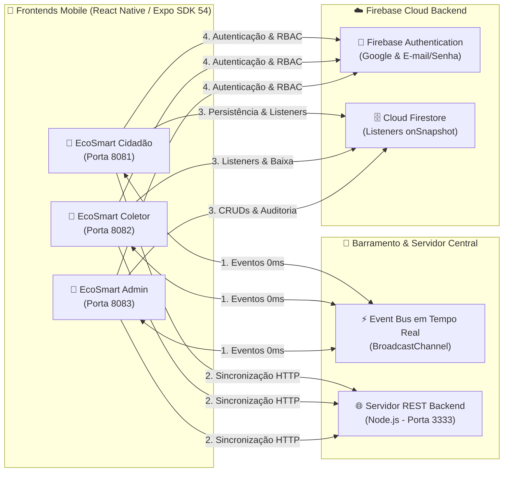

# 📱 Detalhamento Completo dos Aplicativos - EcoSmart Mobile

Este documento descreve detalhadamente cada um dos 3 aplicativos do ecossistema **EcoSmart Mobile**, suas personas, arquitetura, regras de negócio extraídas do código-fonte, fluxos de telas, persistência de dados e integrações com o **Firebase** e o **Servidor de Sincronização Local**.

---

## 🌐 1. Visão Geral e Princípio de Simplicidade

O **EcoSmart Mobile** foi projetado sob a premissa de **simplicidade, leveza e fácil acesso para qualquer usuário**:
* **Sem barreiras de entrada:** Interface limpa e direta, sem formulários extensos, cadastros burocráticos ou fluxos pesados.
* **Operação ágil:** Cidadão registra seu descarte em segundos e o Coletor visualiza por proximidade geográfica (GPS/Haversine) e conclui a coleta em 1 toque diretamente no card.
* **Foco no essencial:** Tipo de material reciclável, quantidade, endereço com suporte a busca por CEP (ViaCEP) / GPS e confirmação direta.

---

## 👤 2. Aplicativo: EcoSmart Cidadão (`frontend/ecosmart-cidadao`)

### 🎯 Propósito e Persona
* **Persona:** Cidadãos e estabelecimentos que geram materiais recicláveis (plástico, papelão, vidro, metal, eletrônicos, óleo vegetal) no município de Cáceres - MT e desejam descartá-los de forma consciente e ágil.
* **Porta padrão:** `8081` (`http://localhost:8081`)
* **Credencial de Teste:** `maria@gmail.com` / `1234` | **Login Google:** `maria.google@gmail.com`

### 🖥️ Telas e Funcionalidades

| Tela | Arquivo | Principais Funcionalidades e Regras de Negócio |
| :--- | :--- | :--- |
| **Autenticação** | `AuthScreen.tsx` | • **Login com Google (Firebase Auth):** Autenticação rápida com conta Google (`signInWithGoogle`). • **Login com E-mail/Senha:** Validação estrita de perfil (RBAC) impedindo que coletores ou administradores acessem o app Cidadão. • **Cadastro Simplificado:** Criação de conta preenchendo apenas nome, e-mail e senha. • **Recuperação de Senha:** Solicitação de token seguro (`ECO-XXXX`) para redefinição imediata de senha em caso de esquecimento. |
| **Início** | `HomeScreen.tsx` | • Painel dinâmico acolhedor com saudação personalizada e avatar. • Resumo rápido com atalhos para cadastro de descarte, histórico, pontos de coleta e perfil. • Indicador em tempo real de descartes pendentes e concluídos. • Banner de conectividade (Online / Modo Offline). |
| **Cadastrar Descarte** | `RegisterDiscardScreen.tsx` | • **Seleção Intuitiva:** Escolha do material reciclável aceito (Plástico, Papel, Vidro, Metal, etc.) e quantidade em volumes. • **Busca por CEP (ViaCEP):** Digitação de CEP com preenchimento automático do Logradouro e Bairro em Cáceres - MT. • **Captura de GPS:** Botão *"📍 Usar minha localização atual (GPS)"* com mapeamento de coordenadas precisas. • **Registro com Foto:** Suporte a fotos de resíduos ou seleção de amostras representativas. • **Modo Offline:** Se não houver conexão, salva localmente com status `Pendente (Offline)` e sincroniza automaticamente via `autoSyncService` ao reconectar. |
| **Histórico** | `HistoryScreen.tsx` | • Listagem completa de descartes pertencentes exclusivamente ao cidadão logado. • **Filtros Dinâmicos:** Filtro rápido por status (*Todos*, *Pendentes*, *Coletados*). • **Busca em Tempo Real:** Campo de pesquisa por material, endereço ou bairro. • Indicadores visuais com badges de status coloridos. |
| **Detalhes do Descarte** | `DiscardDetailsScreen.tsx` | • Visualização detalhada do descarte, endereço completo, quantidade, observações e foto ampliada. • **Exclusão de Descarte:** Botão para cancelar e apagar a solicitação de descarte com sincronização imediata no servidor backend (`crossAppSync.deleteDiscard`) e no Cloud Firestore (`firebaseService.deleteDiscardDocument`). |
| **Pontos de Coleta (PEVs)** | `CollectionPointsScreen.tsx` | • Catálogo de Ecopontos e Pontos de Entrega Voluntária de Cáceres - MT. • **Cálculo de Distância:** Cálculo em km pela fórmula de Haversine a partir do GPS do cidadão. • **Traçado de Rotas:** Botões para abrir trajeto diretamente no Google Maps ou no Waze via deep link. |
| **Dicas Educativas** | `TipsScreen.tsx` | • Feed de boas práticas sobre reciclagem, descarte seguro de eletrônicos, conservação ambiental e preservação do Pantanal. |
| **Perfil do Cidadão** | `ProfileScreen.tsx` | • Resumo estatístico de descartes (Totais, Coletados e Pendentes). • Edição de dados cadastrais (telefone, endereço padrão, número, bairro, cidade e biografia). • Encerramento de sessão (Logout) seguro com limpeza do cache de sessão. |

### 📋 Regras de Negócio do Cidadão (Extraídas do Código)
1. **Isolamento Estrito de Dados:** Cada cidadão visualiza e manipula exclusivamente os descartes vinculados ao seu identificador (`userId` ou `citizenEmail`). Os descartes são persistidos localmente com a chave `@ecosmart_cidadao_discards_${user.id}` para evitar qualquer contaminação entre contas.
2. **Gravação Transparente no Firestore:** Ao registrar um descarte, a função `saveCitizenDiscard` grava os dados normalizados na coleção `descartes` do Cloud Firestore e propaga o evento `NEW_DISCARD` pelo barramento de eventos em tempo real.
3. **Notificação de Recolhimento:** Quando um coletor marca um descarte como recolhido, o aplicativo do cidadão recebe o evento `DISCARD_COLLECTED` em 0ms, atualiza o status do item para `Coletado` e gera uma notificação visual no sino de notificações.

---

## 🚚 3. Aplicativo: EcoSmart Empresa/Catador (`frontend/ecosmart-coletor`)

### 🎯 Propósito e Persona
* **Persona:** Catadores individuais, cooperativas locais de reciclagem (**COOPERCÁCERES**) e empresas de coleta seletiva e logística reversa que atuam em Cáceres - MT.
* **Porta padrão:** `8082` (`http://localhost:8082`)
* **Credencial de Teste:** `lucas@gmail.com` / `1234` | **Login Google:** `lucas.google@gmail.com`

### 🖥️ Telas e Funcionalidades

| Tela | Arquivo | Principais Funcionalidades e Regras de Negócio |
| :--- | :--- | :--- |
| **Autenticação** | `AuthScreen.tsx` | • **Login com Google (Firebase Auth):** Acesso rápido com perfil `coletor`. • **Login E-mail/Senha com RBAC:** Bloqueio de acesso para perfis cidadão/admin com alerta explicativo. • **Cadastro Operacional:** Cadastro com dados do coletor, tipo de veículo de coleta e capacidade de carga. |
| **Início** | `HomeScreen.tsx` | • Menu objetivo e simplificado com 3 opções claras:   1. 📦 **Descartes disponíveis** (com contador de novos descartes)   2. 🚛 **Coletas realizadas** (com histórico)   3. 👤 **Meu Perfil e Logística** |
| **Descartes Disponíveis** | `AvailableDiscardsScreen.tsx` | • Feed em tempo real de todos os descartes com status `pendente`. • **Ordenação por Proximidade GPS:** Ordenação automática dos resíduos mais próximos pela distância de Haversine. • **Ações em 1 Toque no Card:** Botões diretos de `🗺️ Rota GPS` (Google Maps/Waze) e `✅ Coletar` para confirmar a coleta sem precisar trocar de tela. • Filtro por tipo de resíduo (Plástico, Vidro, Metal, Papelão, Todos) e busca por bairro. |
| **Detalhes do Descarte** | `DiscardDetailsScreen.tsx` | • Visualização da foto ampliada do resíduo, endereço completo, quantidade e observações do cidadão. • Botão para traçar rota de navegação direta e botão para confirmar a coleta. |
| **Coletas Realizadas** | `CollectedDiscardsScreen.tsx` | • Histórico consolidado de todos os descartes recolhidos pelo coletor autenticado. • Busca em tempo real por endereço, bairro ou tipo de material. • Exibição da data de conclusão da coleta. |
| **Perfil Operacional** | `ProfileScreen.tsx` | • Gestão dos dados do veículo de coleta (ex: caminhonete, triciclo de carga, caminhão). • Definição da capacidade de carga em kg e bairros de atuação em Cáceres. • Resumo operacional com total de coletas realizadas. |

### 📋 Regras de Negócio do Coletor (Extraídas do Código)
1. **Ação Direta no Card (1 Toque):** O coletor pode traçar a rota GPS e confirmar o recolhimento com apenas um clique diretamente no card do descarte, garantindo máxima agilidade no trabalho de campo.
2. **Não-Regressão de Status:** O código implementa uma regra estrita de consistência: um descarte com status `coletado` **nunca regride** para `pendente`, garantindo a integridade dos dados durante reconciliações e sincronizações periódicas.
3. **Baixa Offline com `offlineSyncPending`:** Caso o coletor confirme o recolhimento em áreas com oscilação de sinal ou sem internet, a coleta é gravada localmente com a flag `offlineSyncPending: true` e sincronizada com o backend e Firestore assim que a conexão é restabelecida.

---

## 👑 4. Aplicativo: EcoSmart Admin (`frontend/ecosmart-admin`)

### 🎯 Propósito e Persona
* **Persona:** Gestores ambientais públicos (SEMATUR - Cáceres MT), administradores do sistema e auditores de sustentabilidade ESG.
* **Porta padrão:** `8083` (`http://localhost:8083`)
* **Credencial de Teste:** `joao@gmail.com` / `1234` | **Login Google:** `joao.google@gmail.com` | **Chave Mestre:** `ADMIN2026`

### 🖥️ Telas e Funcionalidades

| Tela | Arquivo | Principais Funcionalidades e Regras de Negócio |
| :--- | :--- | :--- |
| **Autenticação** | `AuthScreen.tsx` | • **Login com Google (Firebase Auth):** Acesso administrativo verificado. • **Cadastro Protegido por Chave Mestre:** O cadastro de novos administradores exige obrigatoriamente o código de segurança `ADMIN2026`. • Validação estrita RBAC impedindo acesso de cidadãos e coletores. |
| **Início** | `HomeScreen.tsx` | • Painel executivo com cards estatísticos de resíduos, pontos de coleta, dicas e auditoria de descartes. • Indicadores de pendências e coletas concluídas no município. |
| **Auditoria & Registros** | `RecordsScreen.tsx` | • Visão geral de todos os descartes cadastrados no município com busca em tempo real. • Filtro por status (*Todos*, *Pendentes*, *Coletados*). • Possibilidade de exclusão de registros inconsistentes. • **Exportação de Relatórios de Sustentabilidade ESG (CSV):** Botão de exportação que calcula métricas ambientais (Taxa de Reciclagem %, kg de CO₂ evitado e litros de água economizados). |
| **Tipos de Resíduos** | `WasteTypesScreen.tsx` | • CRUD completo (criação, edição, exclusão e busca) de materiais recicláveis aceitos na plataforma. • Sincronização em tempo real com o Cloud Firestore e cache local. |
| **Pontos de Coleta** | `CollectionPointsScreen.tsx` | • CRUD completo de Ecopontos e PEVs municipais com nome, endereço, tipos de resíduos aceitos, horários de atendimento e coordenadas geográficas (Latitude/Longitude). |
| **Dicas Educativas** | `EducationalTipsScreen.tsx` | • CRUD completo de orientações educativas e boas práticas de reciclagem para a população. |
| **Perfil de Gestão Master** | `ProfileScreen.tsx` | • Gestão dos dados institucionais do administrador (nome, telefone, cargo, departamento e declaração de governança ESG). • Dashboard com métricas consolidadas de impacto ecológico e integridade do ecossistema. |

### 📋 Regras de Negócio do Administrador (Extraídas do Código)
1. **Chave Mestre de Segurança (`ADMIN2026`):** Nenhum usuário pode se cadastrar como administrador sem informar a chave de acesso mestre definida no código (`ADMIN_ACCESS_CODE = 'ADMIN2026'`).
2. **Cálculo de Indicadores ESG:** A emissão de relatórios utiliza fatores matemáticos estabelecidos na literatura ambiental:
   * **CO₂ Evitado:** `totalColetado * 2.8 kg` de CO₂ evitado por lote recolhido.
   * **Água Economizada:** `totalColetado * 18 Litros` de água preservada por lote recolhido.
   * **Taxa de Reciclagem:** `(totalColetado / totalGeral) * 100` expressa em porcentagem.
3. **Exportação Estruturada em CSV:** O relatório gerado por `generateCsvReport()` contém colunas delimitadas por ponto-e-vírgula (`;`) e um rodapé com **Resumo Executivo ESG**, pronto para importação no Excel ou Power BI.
