# Arquitetura do EcoSmart Mobile

O ecossistema **EcoSmart Mobile** é organizado em camadas modulares e desacopladas: **Frontend**, **Backend**, **Banco de Dados & Nuvem (Firebase)**, **Camada Compartilhada**, **Executáveis** e **Scripts de Automação**.

```text
Admin cadastra catálogo e monitora ESG -> Cidadão registra descarte (GPS/Fotos/Firestore) -> Empresa/Catador coleta -> Gestão analisa indicadores ESG
```

---

## 🏛️ Estrutura Geral do Projeto

```text
Ecosmart_DMM---Mobile/
├── frontend/                   📱 Aplicativos Mobile (React Native / Expo SDK 54)
│   ├── ecosmart-cidadao/       # App Cidadão (Porta 8081 - Registro, Histórico, Dicas, Pontos, Perfil, Firestore)
│   ├── ecosmart-coletor/       # App Coletor (Porta 8082 - Descartes, Distâncias Haversine, Rotas, Listeners onSnapshot)
│   └── ecosmart-admin/         # App Admin (Porta 8083 - CRUDs, Relatórios ESG em CSV, Perfil/Governança)
│
├── backend/                    ⚙️ API, Controladores & Serviços de Sincronização
│   └── src/
│       ├── controllers/        # Controladores (Auth, Descarte, Coleta, Admin)
│       ├── routes/             # Definições de rotas da API (Auth, Discard, Admin, Sync)
│       ├── services/           # Regras de negócio e sincronização offline
│       └── server.ts           # Ponto de entrada central da API
│
├── database/                   🗄️ Modelagem de Dados & Persistência
│   ├── schemas/                # Esquemas DDL SQL, regras Firestore (firestore.rules) e índices
│   ├── seeds/                  # Carga inicial com fotos, coordenadas GPS e perfis
│   └── repositories/           # Camada de acesso desacoplada (com UUIDs)
│
├── shared/                     🔄 Contratos Compartilhados (Frontend & Backend)
│   ├── models/                 # Modelos de domínio TypeScript
│   ├── services/               # Firebase (Firestore/Auth/Storage), Sincronização, Segurança e Relatórios
│   ├── utils/                  # Haversine (geoUtils), UUID v4 (idUtils) e Validação (validationUtils)
│   └── components/             # Componentes e modais compartilhados (NotificationModal, OfflineBanner)
│
├── executaveis/                🚀 Scripts .bat de Automação com Duplo Clique no Windows
│
├── scripts/                    🛠️ Automações e Sincronização do Monorepo
│   ├── sync-shared.js          # Sincronizador automatizado de shared/ para os frontends
│   ├── ensure-server.js        # Auto-inicializador do Servidor Backend e conexão Firebase
│   ├── sync-server.js          # Servidor REST central de sincronização (Porta 3333)
│   └── test-communication.js   # Diagnóstico automatizado de comunicação da API e Firebase
│
└── docs/                       📚 Documentação e Especificações do Projeto
```

---

## 🔄 Métodos de Sincronização & Persistência

```mermaid
flowchart TD
    subgraph Nuvem_e_Servidores ["1. Servidor Centralizado & Nuvem"]
        BackendAPI["Servidor Backend REST / WebSocket\n(Node.js / Express - scripts/sync-server.js)"]
        FirestoreDB["Banco em Tempo Real\n(Cloud Firestore - Listeners onSnapshot)"]
    end

    subgraph AppCidadao ["2. EcoSmart Cidadão"]
        CidadaoUI["App Cidadão (Cadastro de Descartes & Perfil)"]
        CidadaoStorage["AsyncStorage Isolado:\n@ecosmart_cidadao_discards\n@ecosmart_cidadao_session"]
    end

    subgraph AppColetor ["3. EcoSmart Coletor"]
        ColetorUI["App Coletor (Rotas de Coleta & Baixas)"]
        ColetorStorage["AsyncStorage Isolado:\n@ecosmart_coletor_data\n@ecosmart_coletor_session"]
    end

    subgraph AppAdmin ["4. EcoSmart Admin"]
        AdminUI["App Admin (Catálogos, PEVs & Relatórios ESG)"]
        AdminStorage["AsyncStorage Isolado:\n@ecosmart_admin_waste_types\n@ecosmart_admin_records"]
    end

    CidadaoUI -->|1. Salva localmente apenas seus descartes| CidadaoStorage
    CidadaoUI -->|2. HTTP POST / onSnapshot| BackendAPI
    CidadaoUI -->|3. Sincronização Nuvem| FirestoreDB

    ColetorUI -->|1. Salva localmente seus dados de coleta| ColetorStorage
    ColetorUI -->|2. HTTP PATCH Baixa Coleta| BackendAPI
    ColetorUI -->|3. Listener onSnapshot| FirestoreDB

    AdminUI -->|1. Salva localmente catálogos de gestão| AdminStorage
    AdminUI -->|2. HTTP CRUD & Métricas| BackendAPI
    AdminUI -->|3. Listener onSnapshot| FirestoreDB
```



1. **Servidor Central Backend (Node.js REST na Porta 3333):**
   * Endpoint de mutação rápida HTTP (`POST /api/discards`, `POST /api/discards/:id/collect`, `DELETE /api/discards/:id`).
   * Auto-iniciado automaticamente em segundo plano ao executar qualquer aplicativo.

2. **Banco de Dados em Tempo Real (Firebase Cloud Firestore):**
   * Listeners nativos **`onSnapshot`** em `firebaseService.ts` para atualização instantânea sem recarregamento.
   * Persistência explícita de descartes na coleção `descartes` através de `saveCitizenDiscard()`.

3. **Persistência Local Isolada por Aplicativo (`AsyncStorage`):**
   * Cada aplicativo mantém seus dados locais sob namespace próprio (`@ecosmart_cidadao_*`, `@ecosmart_coletor_*`, `@ecosmart_admin_*`), garantindo que o app Cidadão salve e exiba apenas seus próprios descartes locais.

---

## 🧪 Qualidade & Testes

* **74 suítes de testes** e **382 testes automatizados** com 100% de aprovação.
* **0 erros de tipagem estática** TypeScript (`npm run typecheck:all`).
* **Diagnóstico de Comunicação:** `npm run test:communication`.
