# Arquitetura do EcoSmart Mobile

O ecossistema **EcoSmart Mobile** é organizado em camadas modulares, desacopladas e resilientes: **Frontend**, **Backend**, **Banco de Dados & Nuvem (Firebase)**, **Camada Compartilhada**, **Executáveis** e **Scripts de Automação**.

```text
Admin cadastra catálogo e monitora ESG -> Cidadão registra descarte (GPS/Fotos/Firestore) -> Empresa/Catador coleta -> Gestão analisa indicadores ESG
```

---

## 🏛️ Estrutura Geral do Projeto

```text
Ecosmart_DMM---Mobile/
├── frontend/                   📱 Aplicativos Mobile (React Native / Expo SDK 54)
│   ├── ecosmart-cidadao/       # App Cidadão (Porta 8081 - Registro, Histórico, Detalhes/Exclusão, Dicas, PEVs, Perfil, Firestore)
│   ├── ecosmart-coletor/       # App Coletor (Porta 8082 - Feed, Distâncias Haversine, Ações no Card, Rotas GPS, Listeners onSnapshot)
│   └── ecosmart-admin/         # App Admin (Porta 8083 - CRUDs, Auditoria, Relatórios ESG em CSV, Perfil de Governança)
│
├── backend/                    ⚙️ API, Controladores & Serviços de Sincronização
│   └── src/
│       ├── controllers/        # Controladores (AuthController, DiscardController, AdminController)
│       ├── routes/             # Definições de rotas da API (authRoutes, discardRoutes, adminRoutes, syncRoutes)
│       ├── services/           # Regras de negócio e sincronização offline (syncService)
│       └── server.ts           # Ponto de entrada central e exportação da API
│
├── database/                   🗄️ Modelagem de Dados & Persistência
│   ├── schemas/                # Esquemas DDL SQL, regras Firestore (firestore.rules) e índices (firestore.indexes.json)
│   ├── seeds/                  # Carga inicial com fotos, coordenadas GPS de Cáceres e perfis
│   ├── data/                   # Banco local JSON persistido em disco (ecosmart-live-db.json)
│   └── repositories/           # Repositórios desacoplados com UUIDs (userRepository, discardRepository, adminRepository)
│
├── shared/                     🔄 Contratos Compartilhados (Frontend & Backend)
│   ├── models/                 # Modelos de domínio TypeScript (Usuario, Descarte, CollectorDiscard, AdminDiscardRecord, etc.)
│   ├── services/               # Firebase (Firestore/Auth/Storage), Barramento CrossAppSync, Segurança, CEP e Relatórios ESG
│   ├── utils/                  # Haversine (geoUtils), UUID v4 / IDs Semânticos (idUtils) e Validação (validationUtils)
│   ├── components/             # Componentes modulares compartilhados (NotificationModal, OfflineBanner, AppCard, ScreenHeader)
│   ├── hooks/                  # Hook de monitoramento reativo de rede (useNetworkStatus)
│   └── theme/                  # Constantes visuais, paleta de cores sustentáveis e layout
│
├── executaveis/                🚀 Scripts .bat de Automação com Duplo Clique no Windows
│   ├── MENU-ECOSMART.bat       # Painel interativo central de controle
│   ├── 1-instalar-dependencias.bat
│   ├── 2-executar-testes.bat
│   ├── 3-iniciar-cidadao.bat
│   ├── 4-iniciar-coletor.bat
│   ├── 5-iniciar-admin.bat
│   ├── 6-sincronizar-modulos.bat
│   ├── 7-testar-comunicacao.bat
│   └── 8-iniciar-servidor.bat
│
├── scripts/                    🛠️ Automações e Sincronização do Monorepo
│   ├── sync-shared.js          # Sincronizador automatizado de shared/ para os 3 frontends
│   ├── ensure-server.js        # Auto-inicializador do Servidor Backend e conexão Firebase
│   ├── sync-server.js          # Servidor REST central de sincronização (Porta 3333)
│   ├── test-communication.js   # Diagnóstico automatizado E2E de comunicação da API e Firebase
│   ├── seed-firestore.js       # Script de população inicial do Cloud Firestore
│   └── start-all.js            # Inicialização simultânea de todos os apps e servidor
│
└── docs/                       📚 Documentação Oficial e Especificações do Projeto
```

---

## 🔄 Métodos de Sincronização & Persistência

```mermaid
flowchart TD
    subgraph Nuvem_e_Servidores ["1. Servidor Centralizado, Barramento & Nuvem"]
        EventBus["⚡ Barramento em Tempo Real 0ms\n(BroadcastChannel - ecosmart_realtime_sync_bus)"]
        BackendAPI["🌐 Servidor Backend REST\n(Node.js / HTTP - scripts/sync-server.js - Porta 3333)"]
        FirestoreDB["☁️ Banco em Tempo Real\n(Cloud Firestore - Listeners onSnapshot & RBAC Rules)"]
    end

    subgraph AppCidadao ["2. EcoSmart Cidadão (Porta 8081)"]
        CidadaoUI["App Cidadão (Cadastro, Histórico, Detalhes, PEVs)"]
        CidadaoStorage["AsyncStorage Isolado por Usuário:\n@ecosmart_cidadao_discards_{userId}\n@ecosmart_cidadao_session"]
    end

    subgraph AppColetor ["3. EcoSmart Coletor (Porta 8082)"]
        ColetorUI["App Coletor (Feed com Haversine, Ações no Card, Rotas GPS)"]
        ColetorStorage["AsyncStorage Isolado:\n@ecosmart_coletor_data\n@ecosmart_coletor_session"]
    end

    subgraph AppAdmin ["4. EcoSmart Admin (Porta 8083)"]
        AdminUI["App Admin (Catálogos, PEVs, Auditoria, Relatórios ESG CSV)"]
        AdminStorage["AsyncStorage Isolado:\n@ecosmart_admin_waste_types\n@ecosmart_admin_records\n@ecosmart_admin_session"]
    end

    CidadaoUI <-->|0ms Eventos| EventBus
    ColetorUI <-->|0ms Eventos| EventBus
    AdminUI <-->|0ms Eventos| EventBus

    CidadaoUI -->|1. Salva localmente apenas seus descartes| CidadaoStorage
    CidadaoUI -->|2. HTTP POST / DELETE / GET| BackendAPI
    CidadaoUI -->|3. Sincronização & Listeners| FirestoreDB

    ColetorUI -->|1. Salva localmente seus dados de coleta| ColetorStorage
    ColetorUI -->|2. HTTP POST/PATCH Baixa Coleta| BackendAPI
    ColetorUI -->|3. Listener onSnapshot| FirestoreDB

    AdminUI -->|1. Salva localmente catálogos de gestão| AdminStorage
    AdminUI -->|2. HTTP CRUD & Auditoria| BackendAPI
    AdminUI -->|3. Listener onSnapshot| FirestoreDB
```



### 1. Barramento de Eventos em Tempo Real (0ms de latência)
* Implementado através da classe `CrossAppSyncService` com a API `BroadcastChannel('ecosmart_realtime_sync_bus')`.
* Quando o Cidadão registra um descarte, o evento `NEW_DISCARD` chega instantaneamente para o Coletor e o Admin.
* Quando o Coletor conclui um recolhimento, o evento `DISCARD_COLLECTED` atualiza o status na tela do Cidadão e gera notificação imediata.

### 2. Servidor Central Backend (Node.js REST na Porta 3333)
* Endpoint de mutação rápida HTTP (`GET /api/discards`, `POST /api/discards`, `POST /api/discards/:id/collect`, `DELETE /api/discards/:id`, `GET/POST /api/users`).
* Auto-iniciado automaticamente em segundo plano ao executar qualquer aplicativo pelo script `ensure-server.js`.
* Persistência em arquivo JSON local (`database/data/ecosmart-live-db.json`) com garantia de integridade durante o desenvolvimento.

### 3. Banco de Dados em Tempo Real (Firebase Cloud Firestore)
* Listeners nativos **`onSnapshot`** em `firebaseService.ts` para sincronização instantânea sem necessidade de recarregamento de tela.
* Gravação normalizada na coleção `descartes` com a função `saveCitizenDiscard()`.
* Modelo resiliente: caso o dispositivo fique offline ou sem sinal, opera com cache local em memória e sincroniza reativamente ao reconectar.

### 4. Persistência Local Isolada por Aplicativo e Usuário (`AsyncStorage`)
* Cada aplicativo mantém seus dados locais sob namespace próprio (`@ecosmart_cidadao_*`, `@ecosmart_coletor_*`, `@ecosmart_admin_*`).
* O aplicativo Cidadão persiste os descartes com chave individualizada por usuário (`@ecosmart_cidadao_discards_${user.id}`), garantindo isolamento total e impedindo vazamento de dados entre diferentes contas cadastradas no mesmo aparelho.

---

## 🧪 Qualidade & Testes

* **75 suítes de testes** e **386 testes automatizados** cobrindo telas, componentes, hooks, utilitários e serviços.
* **0 erros de tipagem estática** TypeScript (`npm run typecheck:all`).
* **Diagnóstico de Comunicação:** Script automatizado de teste de rotas REST, Firebase e Storage (`npm run test:communication`).
