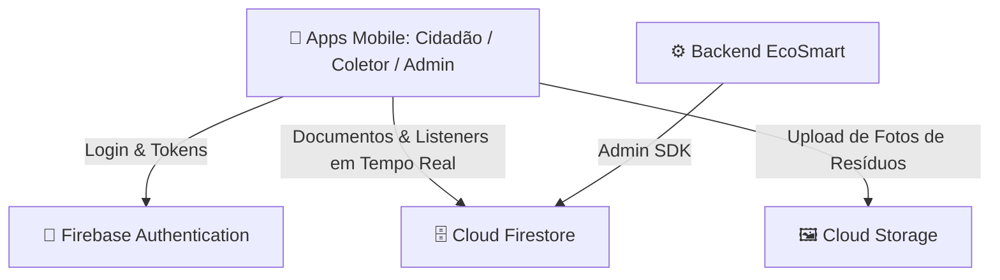

# Guia de Conexão e Configuração do Firebase - EcoSmart Mobile

Este documento explica como conectar o banco de dados **Cloud Firestore**, **Authentication** e **Cloud Storage** do **Firebase** ao ecossistema **EcoSmart Mobile**.

---

## ☁️ 1. Visão Geral da Arquitetura Firebase



### Coleções do Cloud Firestore:
- `usuarios`: Perfis de Cidadãos, Coletores e Administradores com dados cadastrais e provedores de login (E-mail ou Google).
- `descartes`: Solicitações de descarte com fotos, coordenadas GPS, status e logs.
- `tipos_residuos`: Catálogo de materiais recicláveis mantido pelo Admin.
- `pontos_coleta`: Locais de coleta seletiva e ecopontos com geolocalização.
- `dicas_educativas`: Conteúdos educativos sobre descarte consciente.
- `notificacoes`: Alertas em tempo real disparados para usuários e coletores.

---

## 🛠️ 2. Passo a Passo no Firebase Console

### Passo 2.1: Criar o Projeto no Firebase
1. Acesse o [Firebase Console](https://console.firebase.google.com/).
2. Clique em **"Adicionar projeto"** e nomeie como `ecosmart-mobile`.
3. Desative o Google Analytics (opcional) e clique em **"Criar projeto"**.

---

### Passo 2.2: Ativar o Firebase Authentication (E-mail/Senha e Google)
1. No menu lateral esquerdo, clique em **Build > Authentication**.
2. Clique em **"Vamos começar"**.
3. Na aba **Sign-in method**:
   - **E-mail/senha:** Selecione, ative a primeira opção e clique em **"Salvar"**.
   - **Google:** Clique em **"Adicionar novo provedor"**, escolha **Google**, configure o nome público do projeto e e-mail de suporte e clique em **"Salvar"**.

---

### Passo 2.3: Ativar o Cloud Firestore
1. No menu lateral, clique em **Build > Firestore Database**.
2. Clique em **"Criar banco de dados"**.
3. Escolha o local do servidor (recomendado: `southamerica-east1` em São Paulo para menor latência no Brasil).
4. Selecione **"Iniciar no modo de produção"** e clique em **"Criar"**.
5. Na aba **Regras (Rules)**, copie e cole o conteúdo do arquivo [`database/schemas/firestore.rules`](file:///C:/Users/gabri/Documents/faculdade/7%20semestre/DESENVOLVIMENTO%20DE%20SISTEMAS%20PARA%20DISPOSITIVOS%20M%C3%93VEIS/Ecosmart_DMM---Mobile/database/schemas/firestore.rules) do projeto e clique em **"Publicar"**.

---

### Passo 2.4: Ativar o Firebase Cloud Storage (Fotos de Resíduos)
1. No menu lateral, clique em **Build > Storage**.
2. Clique em **"Vamos começar"**, selecione o modo padrão e clique em **"Concluído"**.

---

## 🔑 3. Obter as Chaves e Configurar no Aplicativo

### Passo 3.1: Registrar o Aplicativo Web/Expo
1. Na tela inicial do projeto no Firebase Console, clique no ícone **Web (`</>`)** para registrar um app.
2. Nomeie o app como `EcoSmart Mobile Web/Expo`.
3. O Firebase exibirá um bloco de código `const firebaseConfig = { ... }`.

### Passo 3.2: Configurar as Variáveis de Ambiente
Crie um arquivo `.env` na raiz de cada app frontend (`frontend/ecosmart-cidadao/.env`, `frontend/ecosmart-coletor/.env`, `frontend/ecosmart-admin/.env`) ou edite [`shared/services/firebaseConfig.ts`](file:///C:/Users/gabri/Documents/faculdade/7%20semestre/DESENVOLVIMENTO%20DE%20SISTEMAS%20PARA%20DISPOSITIVOS%20M%C3%93VEIS/Ecosmart_DMM---Mobile/shared/services/firebaseConfig.ts):

```env
EXPO_PUBLIC_FIREBASE_API_KEY="AIzaSyXXXXXXXXXXXXXXXXXXXXXXXXXXXX"
EXPO_PUBLIC_FIREBASE_AUTH_DOMAIN="ecosmart-mobile.firebaseapp.com"
EXPO_PUBLIC_FIREBASE_PROJECT_ID="ecosmart-mobile"
EXPO_PUBLIC_FIREBASE_STORAGE_BUCKET="ecosmart-mobile.appspot.com"
EXPO_PUBLIC_FIREBASE_MESSAGING_SENDER_ID="123456789012"
EXPO_PUBLIC_FIREBASE_APP_ID="1:123456789012:web:abcdef1234567890"
```

---

## 📦 4. Instalação do SDK Oficial do Firebase (Opcional para Modo Live)

Para conectar o SDK nativo do Firebase aos aplicativos Expo:

```bash
# Instalar o SDK oficial do Firebase em cada aplicativo:
cd frontend/ecosmart-cidadao
npx expo install firebase

cd ../ecosmart-coletor
npx expo install firebase

cd ../ecosmart-admin
npx expo install firebase
```

---

## 🛡️ 5. Regras de Segurança RBAC do Firestore

As regras definidas em [`database/schemas/firestore.rules`](file:///C:/Users/gabri/Documents/faculdade/7%20semestre/DESENVOLVIMENTO%20DE%20SISTEMAS%20PARA%20DISPOSITIVOS%20M%C3%93VEIS/Ecosmart_DMM---Mobile/database/schemas/firestore.rules) garantem o isolamento estrito:

- **Cidadão:** Pode criar descartes e visualizar pontos de coleta e dicas. Edita apenas o seu próprio perfil.
- **Coletor:** Pode atualizar o status de descartes de `Pendente` para `Coletado` e ler informações geográficas para atendimento.
- **Administrador:** Acesso de escrita exclusivo sobre `tipos_residuos`, `pontos_coleta` e `dicas_educativas`, além de auditoria geral.

---

## 🔄 6. Sincronização Automática com o Monorepo

Sempre que atualizar a configuração em `shared/services/firebaseConfig.ts`, propague as alterações para todos os 3 aplicativos com:

```bash
npm run sync:shared
```
