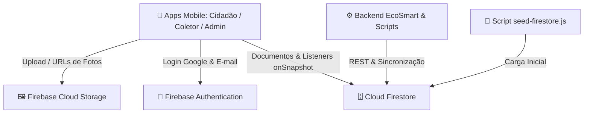

# Guia de Conexão e Configuração do Firebase - EcoSmart Mobile

Este documento explica como conectar o banco de dados **Cloud Firestore**, o **Firebase Authentication** e o **Cloud Storage** do **Firebase** ao ecossistema **EcoSmart Mobile**, bem como as regras de segurança RBAC e a população inicial da base de dados.

---

## ☁️ 1. Visão Geral da Arquitetura Firebase



### Coleções do Cloud Firestore:
- `usuarios`: Perfis de Cidadãos, Coletores e Administradores com dados cadastrais e provedores de login (E-mail ou Google).
- `descartes`: Solicitações de descarte com fotos, coordenadas GPS de Cáceres - MT, status (`pendente` ou `coletado`) e timestamps.
- `tipos_residuos`: Catálogo de materiais recicláveis gerenciado pelo Admin.
- `pontos_coleta`: Locais de coleta seletiva e ecopontos com geolocalização e horários.
- `dicas_educativas`: Conteúdos educativos sobre descarte consciente e preservação do Pantanal.
- `notificacoes`: Alertas em tempo real disparados para usuários e coletores.

---

## 🛠️ 2. Passo a Passo no Firebase Console

### Passo 2.1: Criar o Projeto no Firebase
1. Acesse o [Firebase Console](https://console.firebase.google.com/).
2. Clique em **"Adicionar projeto"** e nomeie como `ecosmart-mobile`.
3. Desative o Google Analytics (opcional) e clique em **"Criar projeto"**.

---

### Passo 2.2: Ativar o Firebase Authentication (E-mail/Senha e Google)
1. No menu lateral esquerdo, clique em **Build > Authentication**.
2. Clique em **"Vamos começar"**.
3. Na aba **Sign-in method**:
   - **E-mail/senha:** Selecione, ative a primeira opção e clique em **"Salvar"**.
   - **Google:** Clique em **"Adicionar novo provedor"**, escolha **Google**, configure o nome público do projeto e e-mail de suporte e clique em **"Salvar"**.

---

### Passo 2.3: Ativar o Cloud Firestore
1. No menu lateral, clique em **Build > Firestore Database**.
2. Clique em **"Criar banco de dados"**.
3. Escolha o local do servidor (recomendado: `southamerica-east1` em São Paulo para menor latência no Brasil).
4. Selecione **"Iniciar no modo de produção"** e clique em **"Criar"**.
5. Na aba **Regras (Rules)**, copie e cole o conteúdo do arquivo [`database/schemas/firestore.rules`](file:///C:/Users/gabri/Documents/faculdade/7%20semestre/DESENVOLVIMENTO%20DE%20SISTEMAS%20PARA%20DISPOSITIVOS%20M%C3%93VEIS/Ecosmart_DMM---Mobile/database/schemas/firestore.rules) do projeto e clique em **"Publicar"**.

---

### Passo 2.4: Ativar o Firebase Cloud Storage (Fotos de Resíduos)
1. No menu lateral, clique em **Build > Storage**.
2. Clique em **"Vamos começar"**, selecione o modo padrão e clique em **"Concluído"**.

---

## 🔑 3. Configuração de Variáveis de Ambiente

Configure as variáveis de ambiente nos arquivos `.env` na raiz de cada app frontend (`frontend/ecosmart-cidadao/.env`, `frontend/ecosmart-coletor/.env`, `frontend/ecosmart-admin/.env`) ou edite [`shared/services/firebaseConfig.ts`](file:///C:/Users/gabri/Documents/faculdade/7%20semestre/DESENVOLVIMENTO%20DE%20SISTEMAS%20PARA%20DISPOSITIVOS%20M%C3%93VEIS/Ecosmart_DMM---Mobile/shared/services/firebaseConfig.ts):

```env
EXPO_PUBLIC_FIREBASE_API_KEY="AIzaSyXXXXXXXXXXXXXXXXXXXXXXXXXXXX"
EXPO_PUBLIC_FIREBASE_AUTH_DOMAIN="ecosmart-mobile.firebaseapp.com"
EXPO_PUBLIC_FIREBASE_PROJECT_ID="ecosmart-mobile"
EXPO_PUBLIC_FIREBASE_STORAGE_BUCKET="ecosmart-mobile.appspot.com"
EXPO_PUBLIC_FIREBASE_MESSAGING_SENDER_ID="123456789012"
EXPO_PUBLIC_FIREBASE_APP_ID="1:123456789012:web:abcdef1234567890"
```

---

## 🛡️ 4. Regras de Segurança RBAC do Firestore (`firestore.rules`)

As regras definidas em [`database/schemas/firestore.rules`](file:///C:/Users/gabri/Documents/faculdade/7%20semestre/DESENVOLVIMENTO%20DE%20SISTEMAS%20PARA%20DISPOSITIVOS%20M%C3%93VEIS/Ecosmart_DMM---Mobile/database/schemas/firestore.rules) garantem o controle de acesso baseado em papéis:

* **Coleção `usuarios`:** Apenas o próprio usuário autenticado pode ler ou editar seu perfil (`isOwner(userId)`).
* **Coleção `descartes`:** Leitura, criação e edição permitidas apenas se o documento estiver vinculado ao UID do usuário logado (`resource.data.userId == request.auth.uid`).
* **Coleções Públicas de Leitura (`tipos_residuos`, `pontos_coleta`, `dicas_educativas`):** Qualquer usuário autenticado pode consultar; apenas administradores (`request.auth.token.perfil == 'admin'`) podem criar, editar ou excluir.
* **Coleção `notificacoes`:** Leitura e escrita restritas ao destinatário do alerta.

---

## 🌱 5. População Inicial do Banco de Dados (Seed Firestore)

Para popular o Cloud Firestore com os dados iniciais de Cáceres - MT (PEVs, tipos de resíduos e dicas educativas):

```bash
node scripts/seed-firestore.js
```

---

## 🔄 6. Sincronização com o Monorepo

Sempre que atualizar a configuração em `shared/services/firebaseConfig.ts`, propague as alterações para todos os 3 aplicativos com:

```bash
npm run sync:shared
```
